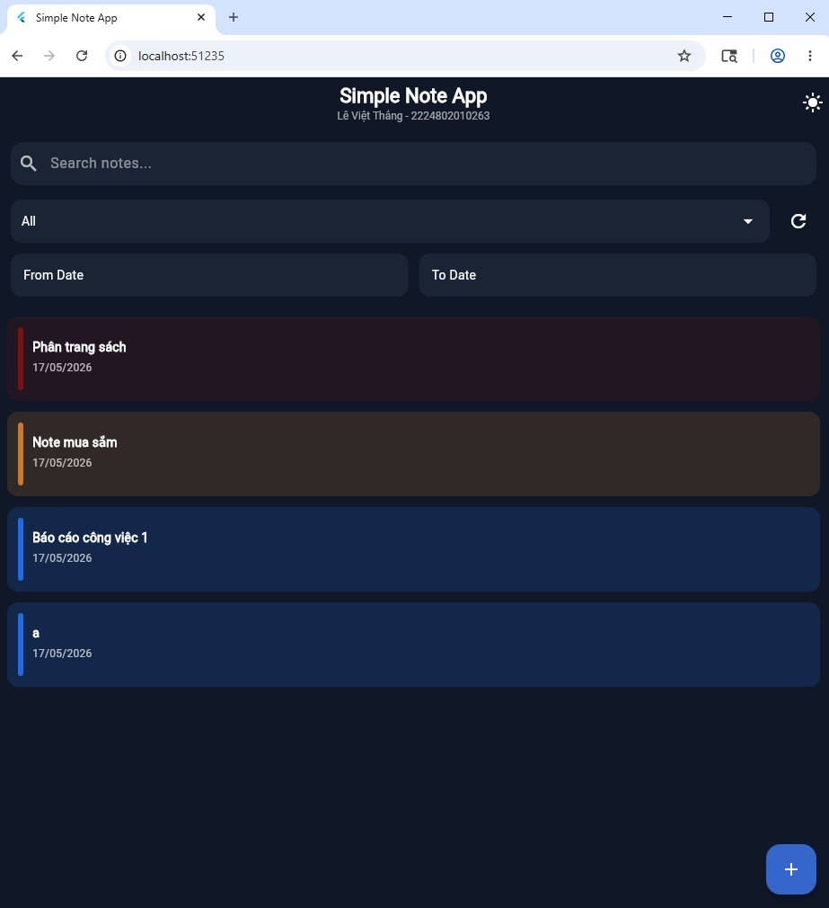
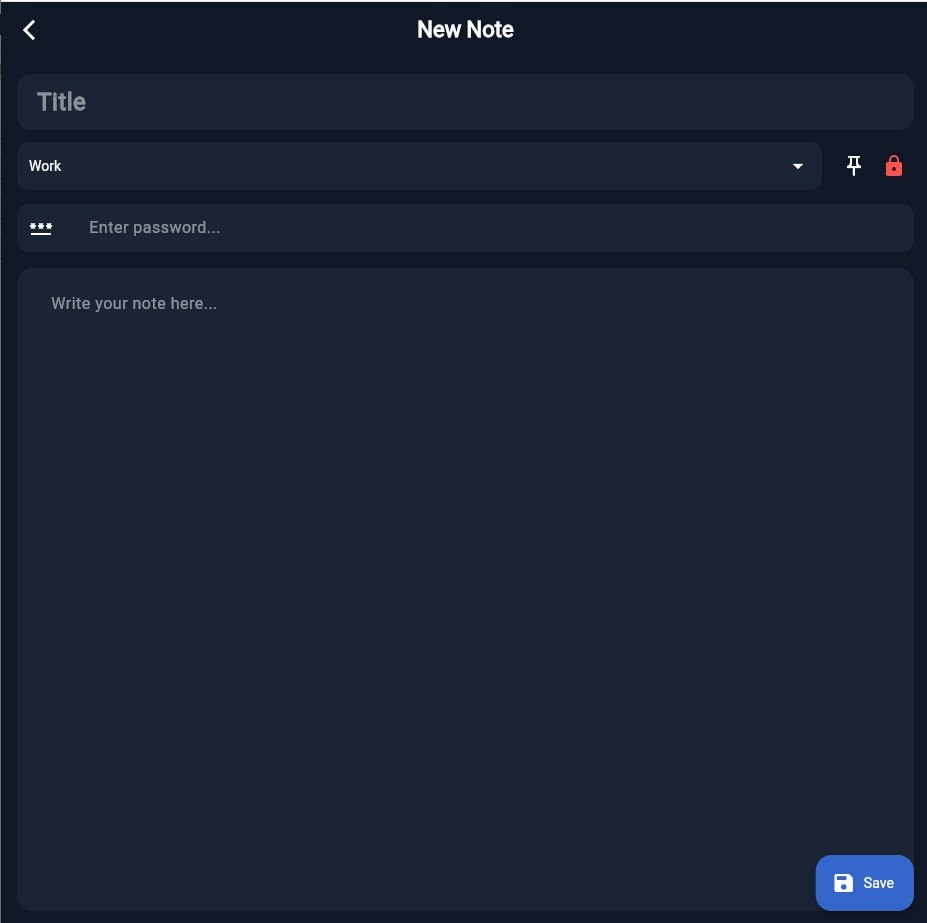
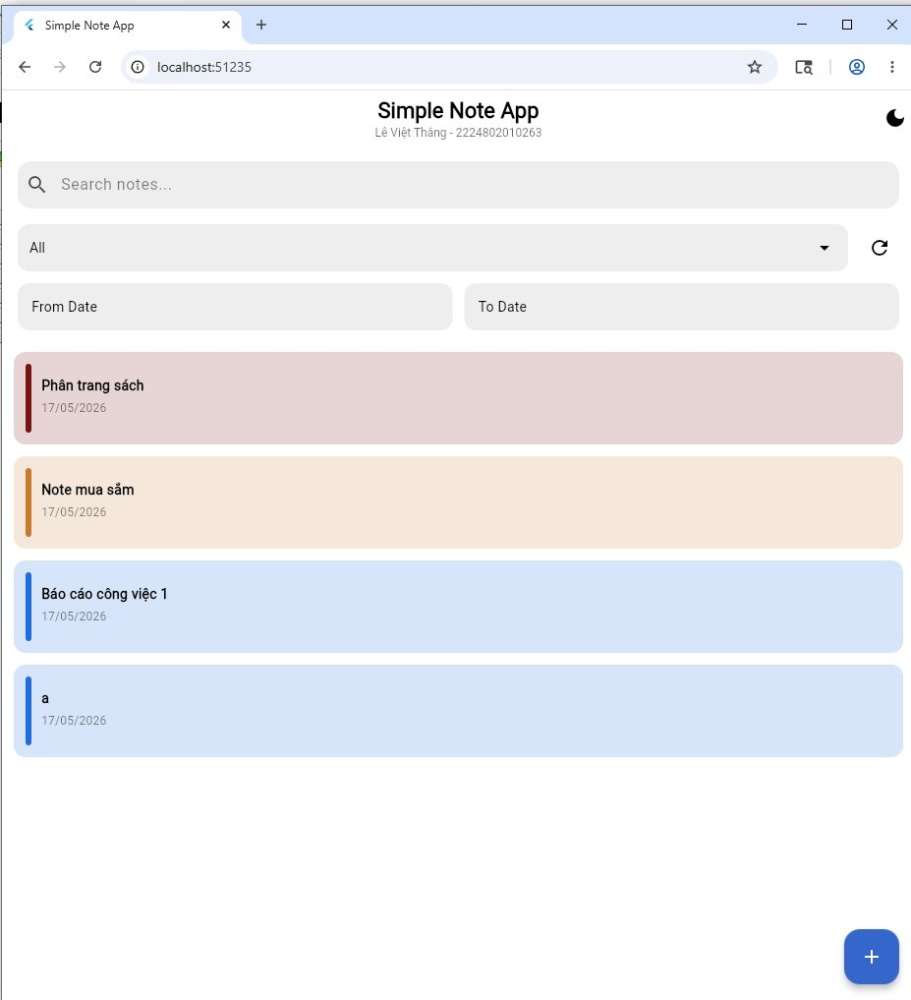

# BÁO CÁO LAB 5 - SIMPLE NOTE APP

## THÔNG TIN SINH VIÊN
- **Họ tên:** Lê Việt Thắng
- **MSSV:** 2224802010263
- **Ngày báo cáo:** 17/05/2026

---

## MỤC LỤC
1. Giới thiệu đề tài
2. Tổng quan dự án
3. Cấu trúc thư mục
4. Tính năng chính
5. Hướng dẫn cài đặt và chạy
6. Hướng dẫn sử dụng (từng bước)
7. Minh họa từng màn hình
8. Kết luận

---

## 1. GIỚI THIỆU ĐỀ TÀI

**Simple Note App** là ứng dụng ghi chú đơn giản được phát triển bằng Flutter, cho phép người dùng tạo, chỉnh sửa, xóa và tìm kiếm ghi chú với các tính năng nâng cao như ghim ghi chú, khóa ghi chú bằng mật khẩu, và lọc theo thẻ/ngày.

---

## 2. TỔNG QUAN DỰ ÁN

### Công nghệ sử dụng:
- **Flutter** - Cross-platform UI framework
- **Provider** - State management
- **SQLite (sqflite)** - Local database cho mobile
- **localStorage** - Persistent storage cho web
- **intl** - Date formatting

### Yêu cầu hệ thống:
- Flutter SDK 3.x trở lên
- Dart SDK 2.x trở lên
- Chrome/Edge/Firefox cho web
- Android Studio hoặc VS Code cho mobile

---

## 3. CẤU TRÚC THƯ MỤC

```
lib/
+-- main.dart                    # Entry point
+-- models/
|   +-- note.dart              # Note data model
+-- database/
|   +-- db_helper.dart          # Database singleton (mobile)
|   +-- web_database.dart      # Web storage (localStorage)
+-- providers/
|   +-- note_provider.dart     # Note state management
|   +-- theme_provider.dart    # Theme state management
+-- screens/
|   +-- home_page.dart          # Main screen
|   +-- note_editor_screen.dart # Create/Edit note screen
+-- widgets/
|   +-- note_card.dart          # Note card widget
+-- utils/
    +-- app_toast.dart          # Toast notifications
```

---

## 4. TÍNH NĂNG CHÍNH

### 4.1 Tính năng cơ bản:
- Tạo ghi chú mới với tiêu đề và nội dung
- Xem danh sách ghi chú dạng scroll
- Chỉnh sửa ghi chú hiện có
- Xóa ghi chú có xác nhận
- Lưu trữ cục bộ (persistent storage)

### 4.2 Tính năng nâng cao:
- **Ghim ghi chú** - Đánh dấu ghi chú quan trọng
- **Khóa ghi chú** - Bảo vệ bằng mật khẩu
- **Phân loại theo thẻ** - Work, Contacts, Shopping, Books, Meeting
- **Tìm kiếm** - Tìm theo tiêu đề, nội dung, thẻ
- **Lọc theo ngày** - Từ ngày - Đến ngày
- **Chế độ sáng/tối** - Dark/Light theme

### 4.3 Giao diện:
- Material Design 3
- Responsive layout
- Smooth animations
- Toast notifications

---

## 5. HƯỚNG DẪN CÀI ĐẶT VÀ CHẠY

### Bước 1: Clone/Download project
```bash
cd "c:\Users\Admin\Desktop\FLUTER_THUCHANH"
git clone <repo-url> Lab5---Simple-Note-App-main
cd Lab5---Simple-Note-App-main
```

### Bước 2: Kiểm tra Flutter
```bash
flutter --version
# Kết quả mong đợi: Flutter 3.x.x
```

### Bước 3: Cài đặt dependencies
```bash
flutter pub get
```

### Bước 4: Chạy ứng dụng

**Chạy trên Web (Chrome):**
```bash
flutter run -d chrome
```

**Chạy trên Android Emulator:**
```bash
flutter run -d android
```

**Chạy trên Windows Desktop:**
```bash
flutter run -d windows
```

---

## 6. HƯỚNG DẪN SỬ DỤNG (TỪNG BƯỚC)

### Bước 1: Mở ứng dụng
- Mở trình duyệt Chrome
- App hiển thị màn hình chính với:
  - Header: "Simple Note App" + "Lê Việt Thắng - 2224802010263"
  - Thanh tìm kiếm
  - Bộ lọc thẻ (Dropdown)
  - Bộ lọc ngày (From Date - To Date)
  - Nút chuyển đổi Dark/Light mode
  - Nút thêm ghi chú (+)

### Bước 2: Tạo ghi chú mới
1. Nhấn nút + (FAB) ở góc phải dưới
2. Màn hình "New Note" xuất hiện
3. Nhập Tiêu đề (ví dụ: "Công việc tuần này")
4. Chọn Thẻ từ dropdown (Work, Contacts, Shopping, Books, Meeting)
5. Nhập Nội dung ghi chú
6. (Tùy chọn) Nhấn Pin để ghim ghi chú
7. (Tùy chọn) Nhấn Lock để khóa ghi chú
8. Nhấn SAVE để lưu

### Bước 3: Xem danh sách ghi chú
- Quay lại màn hình chính
- Ghi chú hiển thị dạng card với:
  - Tiêu đề
  - Nội dung (preview)
  - Thẻ (badge màu)
  - Thời gian cập nhật
  - Pin icon nếu được ghim
  - Lock icon nếu bị khóa

### Bước 4: Chỉnh sửa ghi chú
1. Nhấn vào card ghi chú
2. Nếu ghi chú bị khóa -> nhập mật khẩu
3. Màn hình "Edit Note" xuất hiện
4. Chỉnh sửa thông tin
5. Nhấn SAVE để cập nhật

### Bước 5: Xóa ghi chú
1. Mở ghi chú cần xóa
2. Nhấn biểu tượng Delete
3. Hộp thoại xác nhận xuất hiện
4. Nhấn Delete để xác nhận

### Bước 6: Tìm kiếm ghi chú
1. Nhập từ khóa vào thanh tìm kiếm
2. Kết quả lọc theo thời gian thực
3. Tìm kiếm trong tiêu đề, nội dung, thẻ

### Bước 7: Lọc theo thẻ
1. Chọn thẻ từ dropdown (All, Work, Contacts, Shopping, Books, Meeting)
2. Danh sách tự động lọc theo thẻ

### Bước 8: Lọc theo ngày
1. Nhấn From Date -> chọn ngày bắt đầu
2. Nhấn To Date -> chọn ngày kết thúc
3. Danh sách lọc theo khoảng ngày

### Bước 9: Chuyển đổi Dark/Light mode
1. Nhấn biểu tượng Dark/Light ở góc phải header
2. Giao diện chuyển đổi ngay lập tức

### Bước 10: Xóa bộ lọc
1. Nhấn biểu tượng Refresh
2. Bộ lọc được reset về mặc định
3. Toast thông báo "Filters cleared"

---

## 7. MINH HỌA TỪNG MÀN HÌNH

### Màn hình 1: Trang chủ (Home Page)

*Màn hình chính hiển thị danh sách ghi chú, thanh tìm kiếm, bộ lọc, và thông tin sinh viên*

### Màn hình 2: Tạo/Sửa ghi chú (Note Editor)

*Màn hình tạo hoặc chỉnh sửa ghi chú với các trường: tiêu đề, thẻ, ghim, khóa, nội dung*

### Màn hình 3: Chế độ tối (Dark Mode)

*Giao diện ứng dụng trong chế độ tối*

---

## 8. KẾT LUẬN

### Kết quả đạt được:
- Hoàn thành ứng dụng Simple Note App theo đúng yêu cầu
- Sửa lỗi lưu trữ dữ liệu trên web (sử dụng localStorage thay vì in-memory)
- Thêm thông tin sinh viên vào giao diện
- Hỗ trợ đầy đủ các tính năng CRUD
- Tích hợp dark/light theme
- Triển khai được trên nhiều nền tảng (Web, Mobile, Desktop)

### Hạn chế:
- Web storage sử dụng localStorage (giới hạn ~5MB)
- Chưa có tính năng đồng bộ cloud
- Chưa hỗ trợ hình ảnh/file đính kèm

### Hướng phát triển:
- Thêm tính năng cloud sync (Firebase)
- Hỗ trợ multimedia (hình ảnh, file)
- Xuất/import dữ liệu (JSON, CSV)
- Chia sẻ ghi chú
- Notifications/Reminders

---
